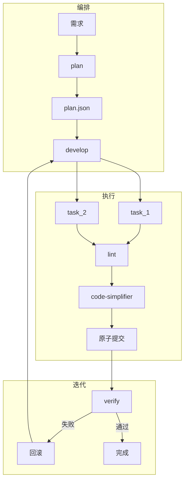

# 架构设计

## 一、整体架构

CodingEngine 采用「编排 + 执行 + 迭代」三层架构，参考 simplerig 阶段机，融入 OMO/ECC/OpenSpec 的最佳实践。



## 二、三层能力详解

### 编排层

- **planner**：按 `context_limit` 拆分任务，产出 plan.json
- **DAG 调度**：任务依赖（dependencies）、模块解耦（decoupled），无依赖可并行
- **来源**：simplerig 阶段机 + OpenSpec 依赖模型

### 执行层

- **每 task**：修改代码 → 立即 lint（ECC 质量门禁）→ code-simplifier 清理 → 原子提交
- **原子提交**：每 task 独立 git commit，message 含 task_id
- **回滚**：失败时 `git revert` 对应 commit
- **来源**：simplerig 产物管理 + git_ops 扩展

### 迭代层

- **verify**：全量 lint + 测试
- **失败**：诊断 → 回滚失败任务 → 重试（最多 3 轮）
- **通过**：wisdom 记录（可选）→ 完成
- **来源**：simplerig 阶段机 + OMO 迭代理念

## 三、数据流

```
用户需求
  → codingengine init → run_id
  → plan 阶段 → plan.json（任务列表、依赖、context_limit）
  → develop 阶段 → 每 task：修改 → lint → code-simplifier → commit
  → verify 阶段 → 全量测试
  → 失败 → 诊断 → revert → 重试（最多 3 轮）
  → 通过 → 完成
```

## 四、事件溯源

所有阶段事件写入 `events.jsonl`，格式为 JSON Lines。每行一个事件，含 `seq`、`type`、`timestamp`、`run_id`、`data`。

**优势**：
- 可恢复：重读 events 重建 RunState
- 可观测：`codingengine tail` 实时消费事件流
- 可审计：完整操作流水
- 断点续传：`--resume` 依赖事件流恢复

**来源**：simplerig 核心机制。

## 五、Skill 即胶水

不建 14 个 Agent、60+ Skill、Hook 适配层。**SKILL.md 为唯一集成点**，驱动 Agent 行为。

四个参考项目的最佳实践通过 Skill 中的自然语言指令融入：
- OMO：Just Do、Boulder 续航、Wisdom
- ECC：编辑后 lint、Confidence-Based Review、Severity 分级
- OpenSpec：任务依赖、模块解耦（体现在 plan.json 结构）
- Anthropic：code-simplifier 原则

## 六、目录结构

见 [AGENTS.md](../../AGENTS.md)。核心目录：

- `src/codingengine/` — 独立 CLI 与阶段逻辑
- `~/.codingengine/runs/<run_id>/` — 数据与产物，不污染项目目录
- `.cursor/skills/` — Skill 胶水
- `.cursor/rules/` — 持久约束
