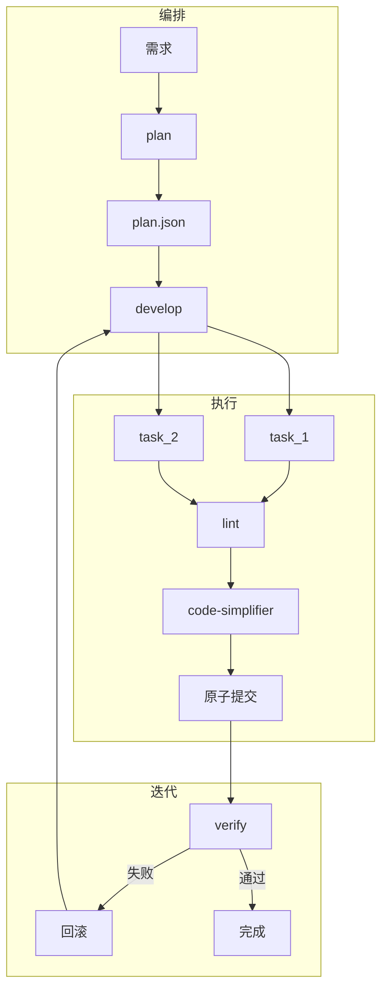

# 架构设计

## 整体架构



## 三层能力

1. **编排** — codingengine planner 按 context_limit 拆分，DAG 调度
2. **执行** — 每 task 原子提交，失败可回滚
3. **迭代** — verify 失败 → 诊断 → 重试（最多 3 轮）

## 数据流

```
用户需求 → init → plan → plan.json
         → develop → 修改 → lint → code-simplifier → commit
         → verify → 通过/失败
         → 完成
```

## 目录结构

见 [AGENTS.md](../../AGENTS.md)。
